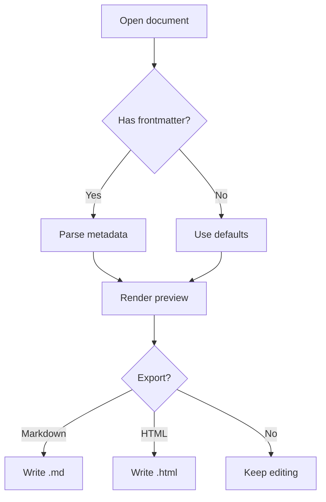
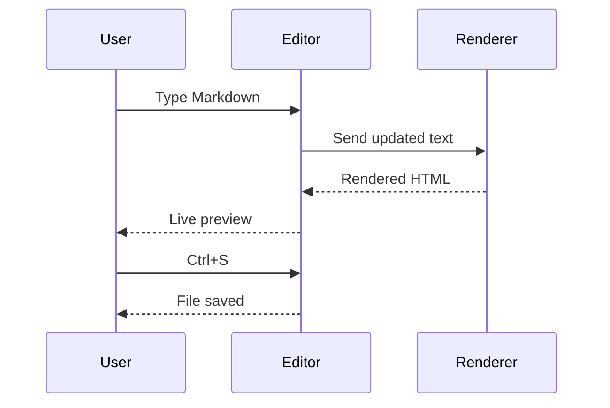
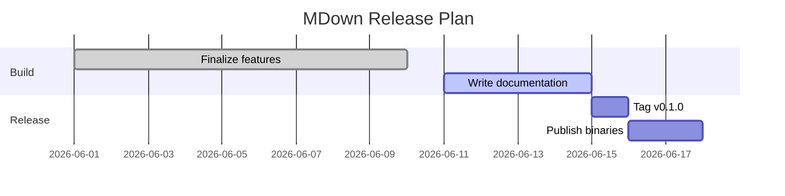
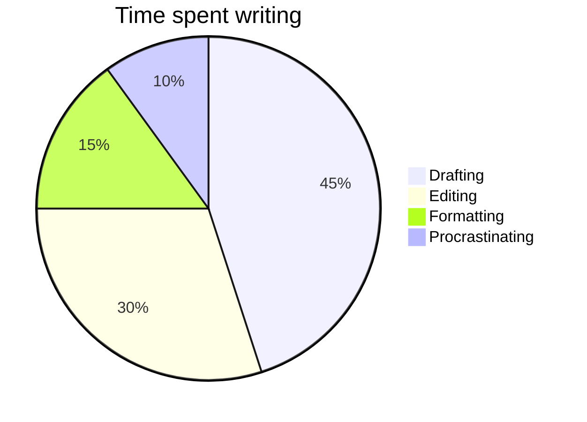
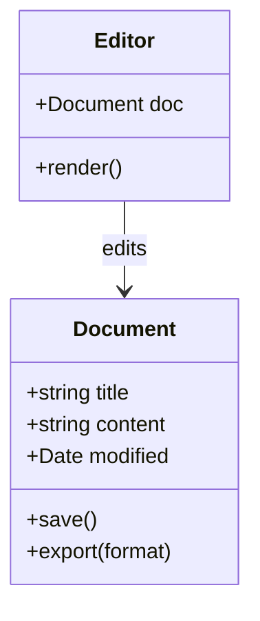

# Diagrams with Mermaid

Fence a code block as `mermaid` and MDown renders it as a diagram in the
preview. Here are a few common kinds.

## Flowchart

## Sequence diagram

## Gantt chart

## Pie chart

## Class diagram

